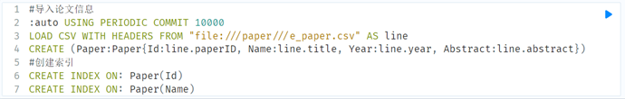
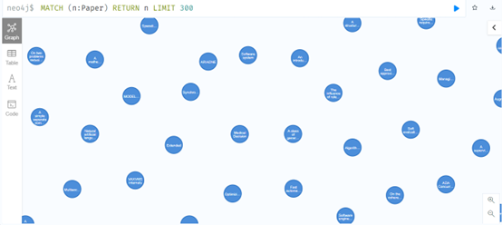
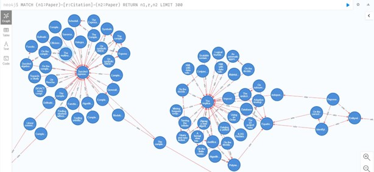
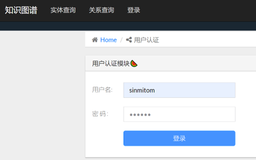
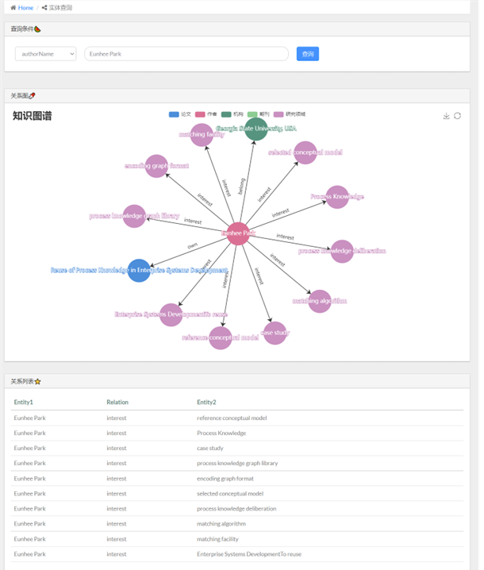
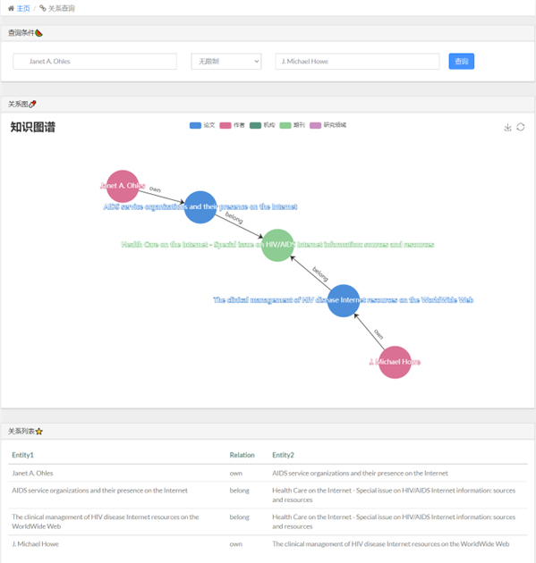

# 基于知识图谱的论文管理系统

@Author 谢文韬 @Date 2022/5/24 记录我的毕业设计

## 摘要

本设计完成了一个基于知识图谱的论文管理系统，实现了知识图谱构建、用户认证、查询图谱信息以及更新图谱信息等功能。系统使用AMiner学术社交网络数据集，设计提取规则获取实体和关系数据，从而搭建出论文信息知识图谱，利用Neo4j图数据库实现图谱存储。依靠Werkzeug依赖和SQLite数据库实现用户认证，根据输入的论文标题或作者姓名信息，在图数据库中进行查询或更新操作，采用最短路径算法查找出两实体的隐含关系。最终使用Flask框架和ECharts可视化工具，将结果以关系图和关系表的形式展示出来，为相关人员提供了一个查询管理论文数据更方便快捷的系统。

## 开发技术与工具

### Neo4j图数据库

官网地址：[Graph Data Platform | Graph Database Management System | Neo4j](https://neo4j.com/)

安装教程：http://t.csdn.cn/RrzQW

（我使用的Neo4j community版本：4.4.4）

### Flask框架

Flask 教程：[简介 - Flask 入门教程 (helloflask.com)](https://read.helloflask.com/)

（我使用的Python版本：3.7.4） 

### 数据源

构建论文知识图谱的数据均来自于，AMiner中的[学术社交引文网络数据集]([Extraction and Mining of Academic Social Networks | AMiner](https://www.aminer.cn/aminernetwork))。

该数据集的内容包含论文的详细信息、论文引用关系数据、作者的详细信息。其相关信息被保存在AMiner-Paper和AMiner-Author文件夹中，共包含200多万条论文信息、800多万条论文引用信息以及100多万条作者的信息。

## 开发流程

### 数据处理

**data_process**文件夹下的文件处理对应的txt文本，将提取出的实体和关系数据存为csv文件

### 知识图谱存储

**data**文件夹下的**知识图谱导入指令**，将csv文件以图数据的形式存入Neo4j数据库

 导入结果：

​                                    

### 系统开发

登录界面

查询界面

查询隐含关系

## 参考

1. [知识图谱实战：构建红楼梦知识图谱](http://t.csdn.cn/c1T3X)

2. [B站：知识图谱实战教程](https://www.bilibili.com/video/BV1iv411k7qG?share_source=copy_web)
3. [Aminer学术社交网络数据知识图谱构建](http://t.csdn.cn/HtdaA)
4. [Github:Aminer学术社交网络数据知识图谱构建](https://github.com/xyjigsaw/Aminer2KG)
5. [Github：汽车知识图谱](https://github.com/Kiwamm/car_knowledge_graph)
6. [Github:农业知识图谱](https://github.com/qq547276542/Agriculture_KnowledgeGraph)

